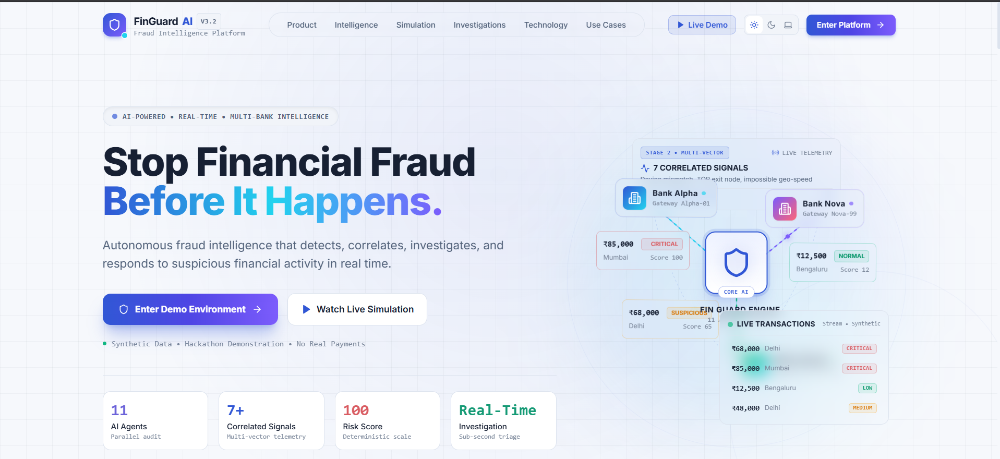
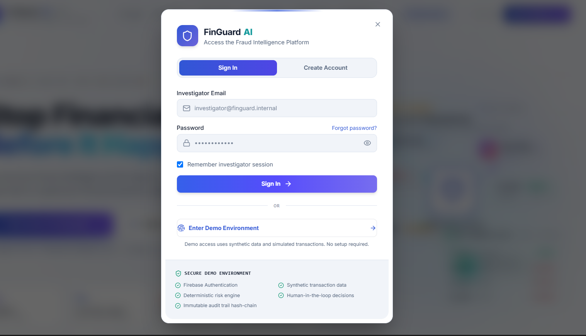
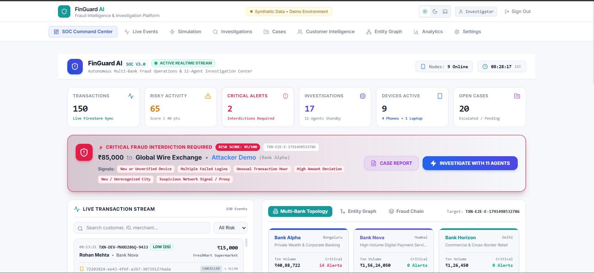
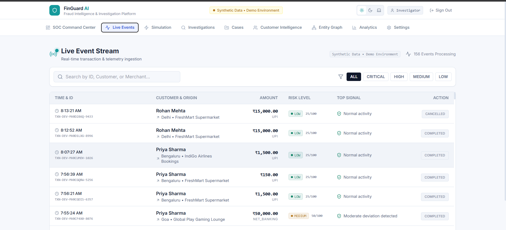
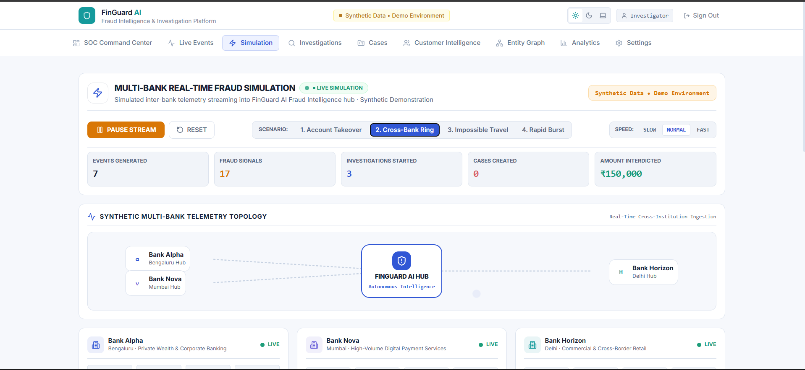
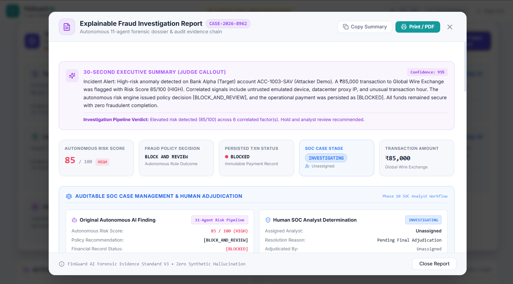
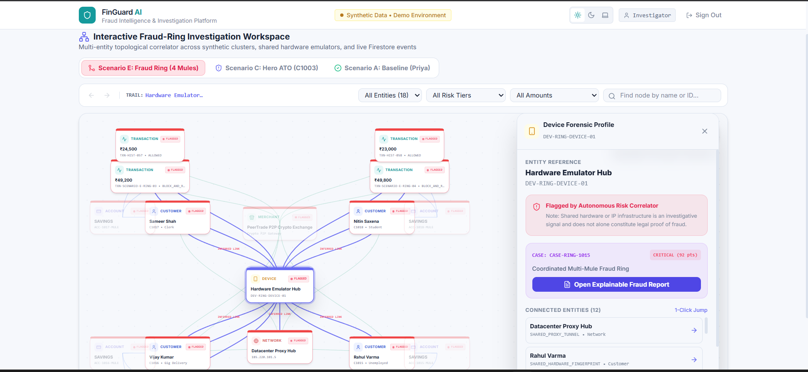

# 🛡️ FinGuard AI

### **Detect → Investigate → Correlate → Explain → Decide → Act**

An AI-powered fraud intelligence and investigation platform that connects suspicious financial activity, correlates evidence, assesses risk, and supports explainable, human-reviewed decisions.

---

## 🚨 About FinGuard AI

FinGuard AI goes beyond simple fraud scoring.

Instead of asking only:

> **“Is this transaction fraudulent?”**

FinGuard AI asks:

> **“Why is it suspicious, what evidence supports it, how are the signals connected, and what should happen next?”**

### Core Workflow

```text
Detect → Investigate → Correlate → Assess Risk → Decide → Act → Human Review
```

---

## 🎯 Problem

Fraud signals are often disconnected. A transaction may look normal by itself, while its surrounding context reveals suspicious behavior.

```text
₹85,000 Transaction
       +
New Device
       +
02:13 AM
       +
Multiple Failed Logins
       +
Bengaluru → Mumbai
       ↓
Potential Account Takeover
```

The challenge is connecting these signals to understand the complete situation.

---

## 💡 Our Solution

FinGuard AI uses specialized investigation agents to analyze different aspects of a transaction and bring the evidence together.

```text
Incoming Transaction
        ↓
Transaction Detection
        ↓
 ┌──────────────┬──────────────┬──────────────┐
 ↓              ↓              ↓
Behavior     Device/Login    Location
Agent           Agent          Agent
 └──────────────┴──────────────┴──────────────┘
                    ↓
            Evidence Correlation
                    ↓
             Risk Assessment
                    ↓
                 Decision
               ↙          ↘
      Simulated Action   Human Review
```

---

## 🤖 Multi-Agent Investigation

The architecture includes specialized components for:

- **Transaction Detection** — identifies suspicious transaction characteristics.
- **Behavior Investigation** — compares activity against expected customer behavior.
- **Device & Login Analysis** — examines devices and authentication activity.
- **Location Analysis** — evaluates location anomalies and travel patterns.
- **Evidence Correlation** — connects signals from multiple domains.
- **Risk Assessment** — calculates a deterministic risk score.
- **Decision Engine** — maps the score to a defined policy outcome.

The goal is to produce an explainable investigation rather than an unexplained fraud score.

---

## 📊 Deterministic Risk Engine

Security-sensitive scoring and decisions are intended to use deterministic code instead of relying entirely on generative AI.

| Signal | Weight |
|---|---:|
| New Device | +15 |
| Multiple Failed Logins | +20 |
| Unusual Hour | +10 |
| High Amount Deviation | +20 |
| New City | +5 |
| Impossible Travel | +20 |
| Suspicious Network Link | +15 |

### Risk Bands

| Score | Risk | Policy Decision |
|---:|---|---|
| 0–30 | LOW | `ALLOW` |
| 31–70 | MEDIUM | `STEP_UP_VERIFICATION` |
| 71–90 | HIGH | `BLOCK_AND_REVIEW` |
| 91–100 | CRITICAL | `BLOCK_AND_CREATE_CASE` |

Scores are capped at 100. A new city or device alone should not automatically establish fraud.

---

## 🛡️ AI Safety

External transaction data is treated as **untrusted input**. Prompt injection must not be allowed to change security-sensitive decisions.

```text
Untrusted Input
      ↓
Validation
      ↓
Evidence Extraction
      ↓
Deterministic Risk Engine
      ↓
Policy Decision
```

Gemini is intended primarily for investigation explanations and summaries, while deterministic code controls scoring and policy decisions.

---

## 👤 Human-in-the-Loop

High-impact investigations can be escalated to human investigators.

Investigators can review:

- Transaction details
- Customer behavior
- Device and login history
- Location evidence
- Network relationships
- Risk scores and reason codes
- Investigation findings
- Case history

Human feedback can record outcomes such as **Confirm Fraud** or **Mark Legitimate**.

---

## 🧪 Demo Scenarios

### 1. Legitimate Transaction

```text
₹1,500
Known Device
Normal Location
       ↓
LOW → ALLOW
```

### 2. Suspicious Transaction

```text
Unusual Amount
Unusual Transaction Time
       ↓
MEDIUM → STEP-UP VERIFICATION
```

### 3. Coordinated Account Takeover

```text
Customer C1003
₹85,000 Transaction
New Device
02:13 AM
Multiple Failed Logins
Bengaluru → Mumbai
       ↓
High-Risk Investigation
       ↓
BLOCK + CREATE CASE
```

### 4. Legitimate Frequent Traveller

Demonstrates why a new location should be evaluated in context rather than treated as proof of fraud.

### 5. Synthetic Fraud Ring

Demonstrates relationships between multiple synthetic identities and shared devices or network signals.

### 6. Prompt Injection

Demonstrates the intended separation between untrusted input, evidence processing, and deterministic security decisions.

---

## 📈 Synthetic Dataset

The prototype uses synthetic data for demonstration.

| Data Type | Count |
|---|---:|
| Customers | 28 |
| Accounts | 13 |
| Devices | 32 |
| Login Events | 28 |
| Merchants | 12 |
| Network Signals | 7 |
| Transactions | 66 |
| Scenarios | 6 |

All figures describe the prototype's documented dataset and may change as the project evolves.

---

## 🗂️ Data Architecture

The Firestore data model includes the following collections:

```text
customers
accounts
transactions
devices
login_events
merchants
network_signals
evidence
correlations
investigations
cases
case_notes
audit_logs
feedback
scenario_runs
system_metrics
```

Audit logs are designed to be append-only, preserving an investigation history.

---

## 🎨 Product Experience

FinGuard AI is designed as a modern fraud-operations console rather than a basic dashboard.

The interface includes:

- Premium light-themed design
- SOC Command Center
- Live transaction monitoring
- Multi-bank fraud simulation
- Autonomous Investigation Cockpit
- Explainable investigation reports
- Customer intelligence
- Interactive fraud-ring network
- Evidence visualization and risk indicators

---

## 📸 Product Screenshots

### 🌐 Landing Page



### 🔐 Investigator Login



### 🖥️ SOC Command Center



### 📡 Live Transaction Stream



### ⚡ Multi-Bank Fraud Simulation




### 📄 Explainable Fraud Investigation Report



### 🕸️ Fraud-Ring Intelligence Network



---

## 🛠️ Technology Stack

### Frontend
- React
- TypeScript
- Vite
- Tailwind CSS
- Framer Motion
- Lucide React

### Backend
- Firebase Authentication
- Firebase Firestore

### AI & Risk
- Multi-Agent Investigation Architecture
- Deterministic TypeScript Risk Engine
- Gemini for AI-assisted explanations, where integrated

### Development Tools
- Google Antigravity
- Firebase CLI / MCP
- Git and GitHub
- gstack

---

## 📁 Project Structure

```text
MinusZero-main/
├── docs/
│   └── screenshots/
├── src/
│   ├── data/
│   ├── firebase/
│   ├── lib/
│   ├── pages/
│   ├── risk/
│   └── types/
├── firestore.rules
├── .env.local
├── package.json
├── tsconfig.json
├── vite.config.ts
└── README.md
```

---

## 🚀 Getting Started

### Prerequisites

- Node.js and npm
- Access to the configured Firebase project
- Environment variables configured locally

### Install Dependencies

```bash
npm install
```

### Start Development Server

```bash
npm run dev
```

### Check TypeScript

```bash
npx tsc --noEmit
```

### Build for Production

```bash
npm run build
```

Keep private environment variables in `.env.local`. Never commit API keys, service-account credentials, or other secrets.

---

## 🔮 Vision

FinGuard AI aims to move fraud operations beyond a simple score:

```text
Transaction → Fraud Score
```

toward a contextual investigation workflow:

```text
Transaction
     ↓
Investigate
     ↓
Correlate Evidence
     ↓
Explain Risk
     ↓
Decide
     ↓
Respond
     ↓
Human Review
```

> **Don't just detect fraud. Investigate it. Understand it. Explain it. Respond to it.**
>## 📄 License

This project is licensed under the [MIT License](LICENSE).

---

## ⚠️ Disclaimer

FinGuard AI is a hackathon prototype that uses **synthetic data and simulated transactions**. It does not process real banking transactions, move real money, or provide production banking, security, compliance, or financial services.
